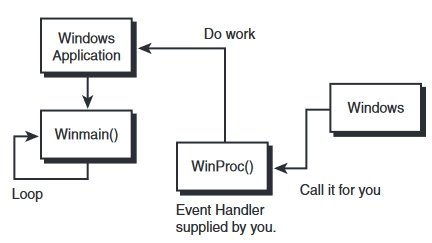

# Win32

[MSDN Get Started with Win32 and C++](https://docs.microsoft.com/en-us/windows/win32/learnwin32/learn-to-program-for-windows)

大致要點
1. 建立entry point, WinMain()
2. 向系統註冊此視窗程式 WNDCLASS
3. 建立與顯示視窗 CreateWindow
4. 訊息監聽(Event Handler) WinProc

---

### 1.建立entry point, WinMain()

```C++
// int WINAPI wWinMain(HINSTANCE hInstance, HINSTANCE, PWSTR pCmdLine, int nCmdShow)
// wWinMain為UniCode模式，WinMain為Ansi模式

int CALLBACK WinMain(
	HINSTANCE hInstance,
	HINSTANCE hPrevInstance,
	LPSTR     lpCmdLine,
	int       nCmdShow){
        
    // ...
    return 0;
}
```

`#define CALLBACK __stdcall`: 簡單來說__stdcall就是專門用來call WinAPI的，詳細還有待研究

參數:

`hInstance` : windows為應用程式生成的追蹤資料，h代表handle(處理程序)

`hPrevInstance` : 追蹤建立此視窗的前一個程式，但現在基本無用

`lpCmdLine` : 相當於int main(int argc, char** argv)的執行時可傳入的參數列</br>
e.g. main.exe -t -d

`nCmdShow` : 為一整數，在執行時傳入來控制視窗的樣式</br>
e.g. SW_MAXIMIZE (3)、SW_MINIMIZE (6)、SW_SHOWMINNOACTIVE (7 啟動時最小化) 等等

---

### 2. 向系統註冊此視窗程式 WNDCLASS

[WNDCLASSA structure (winuser.h)](https://docs.microsoft.com/en-us/windows/win32/api/winuser/ns-winuser-wndclassa)、
[Window Class Styles](https://docs.microsoft.com/en-us/windows/win32/winmsg/window-class-styles)、
[RegisterClass](https://docs.microsoft.com/en-us/windows/win32/api/winuser/nf-winuser-registerclassa)
```C++
typedef struct tagWNDCLASSW {
    UINT        style;
    WNDPROC     lpfnWndProc;
    int         cbClsExtra;
    int         cbWndExtra;
    HINSTANCE   hInstance;
    HICON       hIcon;
    HCURSOR     hCursor;
    HBRUSH      hbrBackground;
    LPCWSTR     lpszMenuName;
    LPCWSTR     lpszClassName;
} WNDCLASSW
```

`style` : 不是造型的那種style，而是視窗行為模式的設定，像是`CS_HREDRAW | CS_VREDRAW`

`lpfnWndProc` : Window事件處理的CallBack，funcPointer

`cbClsExtra`、`cbWndExtra` : 視窗類分配的額外字節數。在大多數情況下，此成員為0。

`hInstance` : 通常直接將WinMain的hinst傳過來即可，因為同一個視窗程式

`lpszMenuName` : Menu ID，不需要的話NULL即可

所以基本上只需要幾個關鍵參數:
```C++
    WCHAR cls_Name[] = L"Win32 Class";    
	WNDCLASS wc = { };
    
	wc.lpfnWndProc = WindowProc;
	wc.lpszClassName = cls_Name;
	wc.hInstance = hInstance;

    // 並在最後向上層系統註冊此視窗類別，為什麼要註冊還有待研究
   	RegisterClass(&wc);
```

### 3. 建立與顯示視窗 CreateWindow

[MSDN CreateWindowExA function](https://docs.microsoft.com/en-us/windows/win32/api/winuser/nf-winuser-createwindowexa)、
[window style values](https://docs.microsoft.com/en-us/windows/win32/winmsg/window-styles)

```C++
void CreateWindowA(
   lpClassName,     //類別名稱，要和剛剛一致
   lpWindowName,    //標題文字
   dwStyle,         //視窗外觀樣式 window style values
   x,               //相對於parent的x座標
   y,               //相對於parent的y座標
   nWidth,          //視窗寬度
   nHeight,         //視窗高度
   hWndParent,      //parent window，沒的話NULL即可
   hMenu,           //menu，沒的話NULL即可
   hInstance,       //當前程式的Hander
   lpParam          //附加資料，沒的話NULL即可
);
returnType HWND
```

使用方式:
基本上照著參數給予資料，就會執行建立視窗這個動作，並返回HWND(此視窗的handle)

```C++
HWND hwnd = CreateWindow(
        cls_Name,               //類別名稱，註冊與建立要是同個視窗類別
        L"Win32 test",          //標題文字
        WS_OVERLAPPEDWINDOW,    //視窗外觀樣式
        100                     //相對於parent的x座標
        200,                    //相對於parent的y座標
        400,                    //視窗寬度
        300,                    //視窗高度
        NULL,                   //parent window，沒的話NULL即可
        NULL,                   //menu
        hInstance,              //當前程式的追蹤
        NULL);                  //附加資料

if (hwnd == NULL) //判斷是否成功Create
    return 0;
```

### 4. 訊息監聽(Event Handler) WinProc


整個視窗程式不是單純建立而已，Windows背後會處裡很多事情，像是基本滑鼠鍵盤的IO、WM_CREATE建立時發起的事件、WM_DESTROY(在關閉視窗後釋放資源)、WM_Paint視窗繪製事件等等，所以需要透過監聽的方式持續檢查收到甚麼消息

如果只有前面那幾段，程式會是開起來後馬上關掉，其實不是執行失敗，而是執行後馬上就結束了，像是Console中可以透過system("pause")或是getchar()來卡著程式直到使用者輸入，但視窗程式用戶除了鍵盤以外還有滑鼠等各種操作，如移動視窗、縮放視窗、縮小視窗等等，用getchar()會導致程式卡在這裡無法進行其他操作

所以windows視窗程式透過無限迴圈讓程式一直不結束，只是這樣一樣甚麼事情都做不了，也無法關閉程式，這時就有了事件監聽這種設計，在必要的時候傳指令給程式，讓程式做出對應的功能，像是按下X的時候，系統會送出QUIT的事件，讓程式知道現在要關閉程式釋放資源

而有事件監聽後，就要有地方來儲存累積起來的事件，讓程式逐一處理，而這就是訊息序列MsgQueue

```C++
  typedef struct tagMSG {
    HWND   hwnd;
    UINT   message;
    WPARAM wParam;
    LPARAM lParam;
    DWORD  time;
    POINT  pt;
  } MSG, *PMSG, *LPMSG;
```


### 完整範例Code

執行方法，VS建立empte winodws專案，加入CPP檔案並把這段貼上即可
```C++
#include <Windows.h>

//LRESULT CALLBACK WindowProc(_In_ HWND hwnd, _In_ UINT uMsg, _In_ WPARAM wParam, _In_ LPARAM lParam);
LRESULT CALLBACK WindowProc(HWND hwnd, UINT uMsg, WPARAM wParam, LPARAM lParam);//MSDN

// entry point
//_In_opt_ SAL annotations(向編譯器詳細規範參數型態)
int CALLBACK WinMain(
    _In_ HINSTANCE hInstance,
    _In_opt_ HINSTANCE hPrevInstance,
    _In_ LPSTR lpCmdLine,
    _In_ int nCmdShow)
{
    WCHAR cls_Name[] = L"Win32 Class";
    /*
    執行時此處要注意
    RegisterClass():
    MSDN:You must fill the structure with the appropriate class attributes before passing it to the function.

    表示WNDCLASS需要完全初始化才行，如果沒有全部初始化，會導致變數無法正確的分配空間，導致註冊失敗
    要不就是所有變數手動指定預設資料，但有點麻煩，所以需要 WNDCLASS wc = { sizeof(WNDCLASS) };
    再簡化就是WNDCLASS wc = { };

    補充:
    typedef struct rectStruct
    {
        int x;
        int y;
        int width;
        int height;
    } RECT
    初始化所有資料: RECT rect = { 0, 0, 20, 30 };
    初始化所有為預設值(此為int所以為0) RECT rect = { };
    */
    WNDCLASS wc = { };

    wc.hbrBackground = (HBRUSH)COLOR_WINDOW;
    wc.lpfnWndProc = WindowProc;
    wc.lpszClassName = cls_Name;
    wc.hInstance = hInstance;

    // 向上層註冊
    RegisterClass(&wc);

    HWND hwnd = CreateWindow(
        cls_Name,               //類別名稱，要和剛剛一致
        L"Win32 test",          //標題文字
        WS_OVERLAPPEDWINDOW,    //視窗外觀樣式
        100,                    //相對於parent的x座標
        200,                    //相對於parent的y座標
        800,                    //視窗寬度
        600,                    //視窗高度
        NULL,                   //parent window，沒的話NULL即可
        NULL,                   //menu
        hInstance,              //當前程式的追蹤
        NULL);                  //附加資料

    if (hwnd == NULL) //判斷是否成功Create
        return 0;

    // 顯示視窗
    ShowWindow(hwnd, SW_SHOW);

    // 更新視窗，通常可有可無，因為只要視窗開著，WM_PAINT就會持續調用並更新視窗
    //UpdateWindow(hwnd);

    // 事件訊息loop
    MSG msg;
    while (GetMessage(&msg, NULL, 0, 0))
    {
        TranslateMessage(&msg);
        DispatchMessage(&msg);
    }
    return 0;
}

// callback事件處裡 function pointer
LRESULT CALLBACK WindowProc(HWND hwnd, UINT uMsg, WPARAM wParam, LPARAM lParam)
{
    switch (uMsg)
    {
        case WM_DESTROY:
        {
            PostQuitMessage(0);
            return 0;
        }
    }
    return DefWindowProc(hwnd, uMsg, wParam, lParam);
}
```