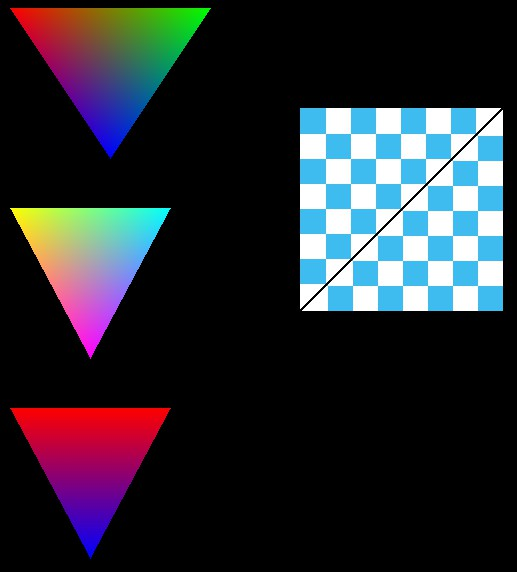

# RenderLearningPlan

https://beadx6ggwp.github.io/

## 主線 :

GAMES101: 现代计算机图形学入门-闫令琪:屬於理論課程，從投影轉換到紋理貼圖，再到光線追蹤與進階研究

[課程主頁](https://sites.cs.ucsb.edu/~lingqi/teaching/games101.html)
[課程影片](https://www.bilibili.com/video/BV1X7411F744)
[重點整理](https://zhuanlan.zhihu.com/c_1249465121615204352)
[Final](http://games-cn.org/wp-content/uploads/2020/04/Final_Project.pdf)

[GAMES202](https://sites.cs.ucsb.edu/~lingqi/teaching/games202.html): 高质量实时渲染Real-Time High Quality Rendering

[CS 148 Introduction to Computer Graphics and Imaging](https://web.stanford.edu/class/cs148/lectures.html)

[Computer Graphics (ECS175)](https://www.youtube.com/playlist?list=PL_w_qWAQZtAZhtzPI5pkAtcUVgmzdAP8g)

[MIT 6.837 Computer Graphics (Fall 2003)](https://ocw.mit.edu/courses/electrical-engineering-and-computer-science/6-837-computer-graphics-fall-2012/lecture-notes/)

[CS291A: Real-Time High Quality Rendering](https://sites.cs.ucsb.edu/~lingqi/teaching/cs291a.html)

[Nvidia Devloper GPU Gems](https://developer.nvidia.com/gpugems/gpugems/contributors)

[【完整版-麻省理工-线性代数】全34讲+配套教材](https://www.bilibili.com/video/av58706273)

參考: 
- Fundamentals Of Computer Graphics - Peter Shirley, Steve Marschner
- Real-Time Rendering 3rd
- C++ primer:[link](https://github.com/applenob/Cpp_Primer_Practice)

## 計畫&進度

其他在[Project](https://github.com/beadcaptain/RenderLearningPlan/projects/3)中，快捷鍵"g+b"

Soft Render [理想目標](https://github.com/ZeusYang/TinySoftRenderer):
- 投影(攝影機、裁切)
- 貼圖(Mipmap、noraml mapping、雙線性採樣)
- 光源(環境光、反射)
- 陰影(硬陰影、軟陰影)
- 條件著色(Z-buffer、Alpha blending)
- 反鋸齒(MSAA)

目前大概是打算這樣前進

- [X] win api與windows建立視窗程式的流程與原理
- [X] 用C++在~~DirectX/OpenGL~~中繪製圖形(改用WinAPI GDI)
- [X] 畫點、線DrawLine: DDA/Bresenham
- [X] Transformation Matrices
- [X] FillTriangle/Triangle rasterization
- [X] 基本線框模型(正方體、三角體)
- [X] Perspective projection
- [X] Backface Culling 本質上是光線法向量夾角
- [X] Basice Diffuse Reflection
- [X] Camera moveing
- [X] Clipping
- [X] Z-buffer
- [X] [Line/Tri RGB gradient](https://www.youtube.com/watch?v=t7Ztio8cwqM)
- [X] 三角重心插值轉換
- [X] RGB三點插值三角形
- [ ] 投影轉換的1/z,投影產生的非線性問題
- [X] 合併z-buffer & texture & 投影轉換
- [X] 圖片讀取 & 貼圖載入
- [X] Blender編輯紋理模型與讀取
- [X] Ground Shading 頂點法向量差值
- [X] normap mapping 法向量貼圖
- [X] Phone Shading 像素法向量差值 之後可使用normap mapping
- [X] 簡易Pipeline
- [X] Wireframe Render
- [ ] Accelerated Half-Space Triangle Rasterization
- [ ] Shadow mapping
- [ ] 複數平面
- [ ] 四元數旋轉變換
- [ ] 以傅立葉轉換分析圖片與採樣

詳細可參考"其他"倒數三個連結

## 補充資料

MSVC STL source code:https://github.com/microsoft/STL

理論:
- 3Blue1Brown 線性代數的本質: https://www.bilibili.com/video/BV1ys411472E
- Introduction to Computer Graphics-Projection and Viewing: http://math.hws.edu/graphicsbook/c3/s3.html
- songho Rendering Pipeline: http://www.songho.ca/opengl/index.html
- how OpenGL works: software rendering:[Github](https://github.com/ssloy/tinyrenderer)
- 帽捲-電腦圖學01-Transformation:[Article](https://medium.com/maochinn/%E9%9B%BB%E8%85%A6%E5%9C%96%E5%AD%B801-transformation-%E6%96%BD%E5%B7%A5%E4%B8%AD-ea46dedf01f9)
- Computer Graphics from scratch:[Article](https://gabrielgambetta.com/computer-graphics-from-scratch/table-of-contents.html)
- ScratchaPixel : https://www.scratchapixel.com/index.php
- 二圈妹圖形學筆記:[知乎](https://www.zhihu.com/column/cgnotes)

實作:
- WIN32 BASIC:[How to program a game in C++](https://www.youtube.com/playlist?list=PL7Ej6SUky135IAAR3PFCFyiVwanauRqj3)
- Code-It-Yourself! 3D Graphics Engine: [Youtube](https://www.youtube.com/playlist?list=PLurMPW-GkXTxWNgznMbq41oWEZBgwMItx)
- 3D Software Rendering:[Youtube](https://www.youtube.com/playlist?list=PLEETnX-uPtBUbVOok816vTl1K9vV1GgH5)
- 3D Game Engine Development Tutorial:[Youtube](https://www.youtube.com/watch?v=OJt-1qAjY7I&list=PLEETnX-uPtBXP_B2yupUKlflXBznWIlL5&index=61)
- C++ 3D DirectX Programming:[Youtube](https://www.youtube.com/watch?v=_4FArgOX1I4&list=PLqCJpWy5Fohd3S7ICFXwUomYW0Wv67pDD)
- 软渲染器Soft Renderer:https://yangwc.com/categories/Soft-Renderer/
- Brian Will:https://www.youtube.com/channel/UCseUQK4kC3x2x543nHtGpzw

參考的Github:
- SRender : https://github.com/SunXLei/SRender
- mini3d : https://github.com/skywind3000/mini3d

單篇內容:
- [OpenGL投影矩阵(Projection Matrix)构造方法](https://zhuanlan.zhihu.com/p/73034007)
- [現代啟示錄 正交投影──威力強大的線代工具](https://ccjou.wordpress.com/2010/04/19/%e6%ad%a3%e4%ba%a4%e6%8a%95%e5%bd%b1-%e5%a8%81%e5%8a%9b%e5%bc%b7%e5%a4%a7%e7%9a%84%e4%bb%a3%e6%95%b8%e5%b7%a5%e5%85%b7/)
- [電腦圖學渲染管線](https://www.slideshare.net/riverwang54/20170621-77540223)
- Math for Game Programmers: Understanding Homogeneous Coordinates:[youtube](https://www.youtube.com/watch?v=o1n02xKP138)

書單:allenchou.net/2014/03/book-list-game-devs/

## 大致樣貌

2020/10/15:

11/24:

12/02 clipping

12/25 Z-buffer & basic texture

1/21 texture

4/08 改用tinyrenderer

04/29

修正浮點數對齊、重整Vector與Matrix的使用

2021/06 basic shader & Normal mapping & Render pipeline

07/03 wireframe render

https://davidhsu666.com/archives/wireframe-display/

11/5  Fixed Camera & Perspective

naive interpolation

Perspective Correct Interpolation and Vertex Attributes

## 原理

## 工具

JavaScript建議用VSCode

C++用VisualStudio2019、VScode+GCC+CM

## 其他

先不整理，單純先丟出跟我們方向相關的資源

應該會重點圍繞在這本書上，我這有簡中版，Tricks of the 3D Game Programming Gurus - Advanced 3D Graphics and Rasterization

有些內容過時了，可能要慢慢研究替待方法

Practical Rendering and Computation with Direct3D 11

PDF電子書 [Google Drive](https://drive.google.com/drive/folders/1YCooGN86mw_TNKmTB8LpJHbhuswdmCQk?usp=sharing)

https://github.com/skywind3000/mini3d

https://github.com/sdlwlxf1/tinyEngine

https://github.com/zauonlok/renderer

https://github.com/QianMo/Real-Time-Rendering-3rd-CN-Summary-Ebook

https://github.com/ssloy/tinyrenderer

https://github.com/ssloy/tinyraytracer

https://github.com/john-chapman/im3d

https://github.com/tinyobjloader/tinyobjloader

https://github.com/miloyip/game-programmer 

https://github.com/utilForever/game-developer-roadmap 

https://www.zhihu.com/question/26720808/answer/33885578 

https://www.zhihu.com/question/27544895/answer/99021929

https://www.zhihu.com/question/30296764/answer/49978571

## 支線:Coding Math

基礎練習，大概了解一些數學在繪製中運作的原理，與培養一些感覺

[Coding Math播放清單](https://www.youtube.com/playlist?list=PL7wAPgl1JVvUEb0dIygHzO4698tmcwLk9)

**EP1~26**都可以跟著做，基本上就是先看完前1~5，然後剩下就是挑有興趣的做就好，基本上先了解繪製是在幹嘛就好

跟方向最相關的是**22~26**，15、16、19、20、21可以先跳過，而覺得弄得差不多了可以在試48、49、54

SourceCode影片都有附上，https://github.com/beadcaptain/CodingMath 而這個是我自己之前做的這樣

## 補充資源

[國中幾何](https://www.youtube.com/watch?v=XE8So0BH-hU&list=PLGLWAatm7Y2Vkyw_NR5dy642ok6_IG3tw&index=40)

Q仔數學教室

[高一上:](https://www.youtube.com/playlist?list=PL-QFPCjbXoYFBtMAWWp_WLMjJBWbcB55B)
算幾不等式、乘法公式、斜率、多項式函數、餘式定理、因式定理、指數對數

[高一下:](https://www.youtube.com/playlist?list=PL-QFPCjbXoYG8gR67iWmoBbbgusHXrOff)
數列、等差級數、排列組合、機率、貝式定理

[高二上:](https://www.youtube.com/playlist?list=PL-QFPCjbXoYFqDzZKdhqKWnc5iSgcwm6r)
三角函數、線性規劃、向量、行列式

[高二下:](https://www.youtube.com/playlist?list=PL-QFPCjbXoYGkysC3LWTlP23Kgwhlg0tb)
空間、平面方程式、矩陣、拋橢雙漸

[高三上:](https://www.youtube.com/playlist?list=PL-QFPCjbXoYGwZ3MYrlPbeJN1K8CFuPqv)
期望值、二項分布、信賴區間、三角函數、圓、複數極式、俐美佛

[高三下:](https://www.youtube.com/playlist?list=PL-QFPCjbXoYEKqyExJnwBzaDuGNT-chIm)
微積分

Stepp學院
https://www.youtube.com/channel/UCQSWNKMOSkJN4xYFFaYSrsw

## 其他

VS2019有時會有編譯快取太大的問題，tool/options/textEditor/C/C++/Advanced "auromatic precompiled header" 把這個選項拉小，像是64MB這樣
